# Lecture-7
#
## #1 Synchronous and Asynchronous
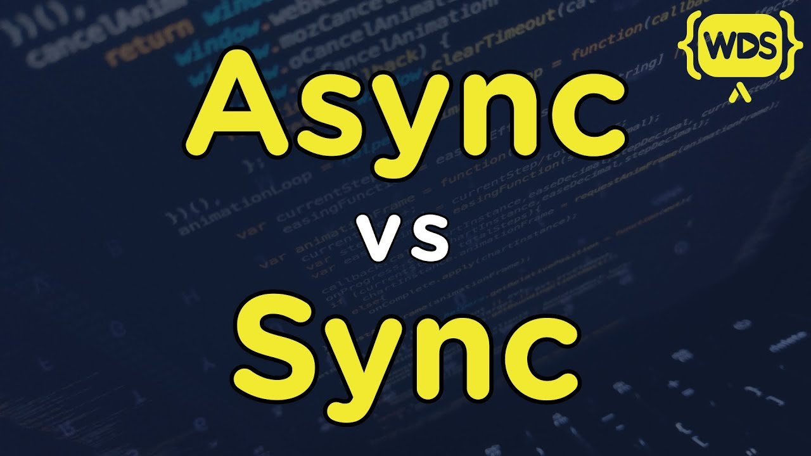
## Synchronous
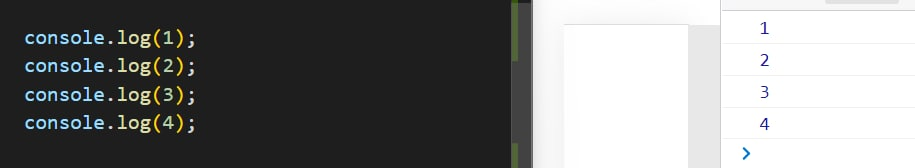
## Asynchronous
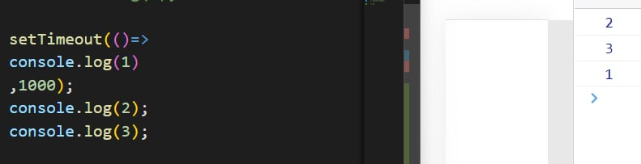
## method setTimeout()
### setTimeout("function",minsec)
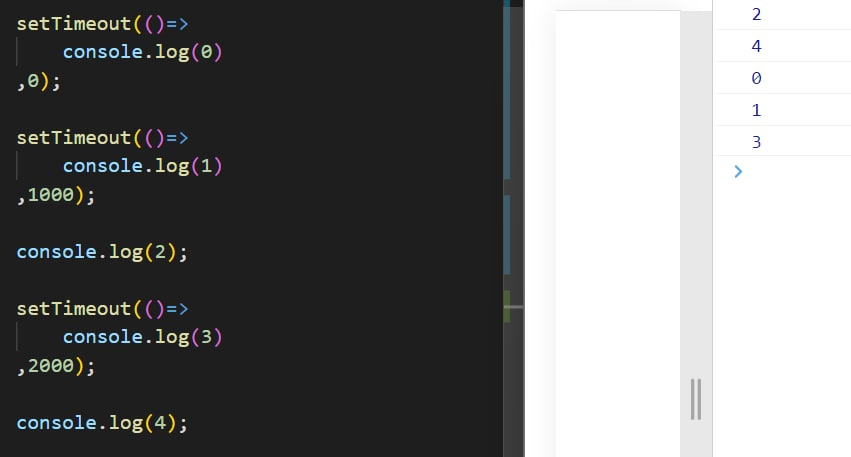
## method setInterval()
### setInterval("function",minsec)
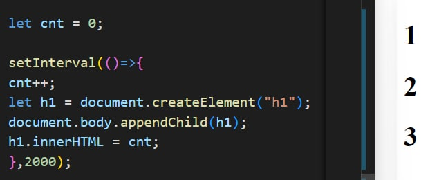
#
## #2 CallBack and Promise
## CallBack
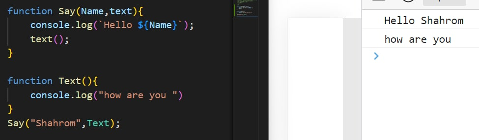
## Promise

### when true
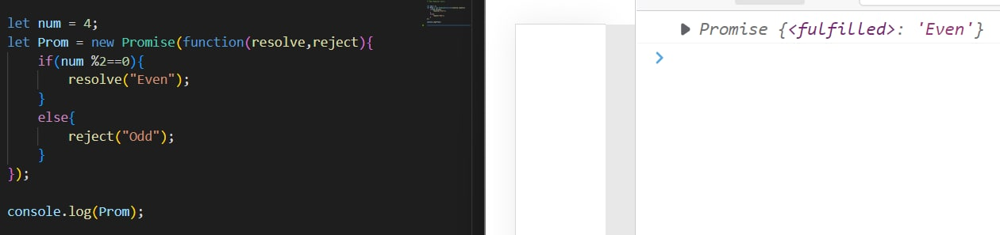
### when false
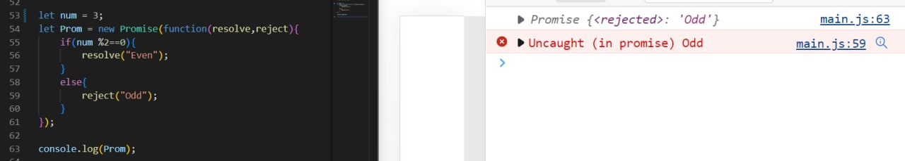
#
## #3 Try/catch/finally and Asunc await

## Try/catch/finally and method errors

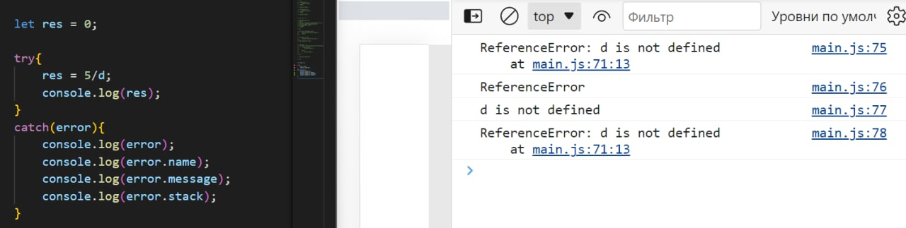
#
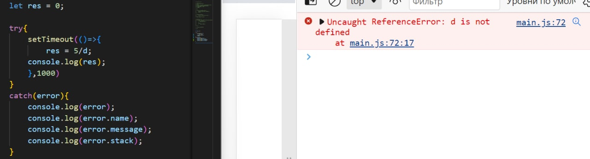
#
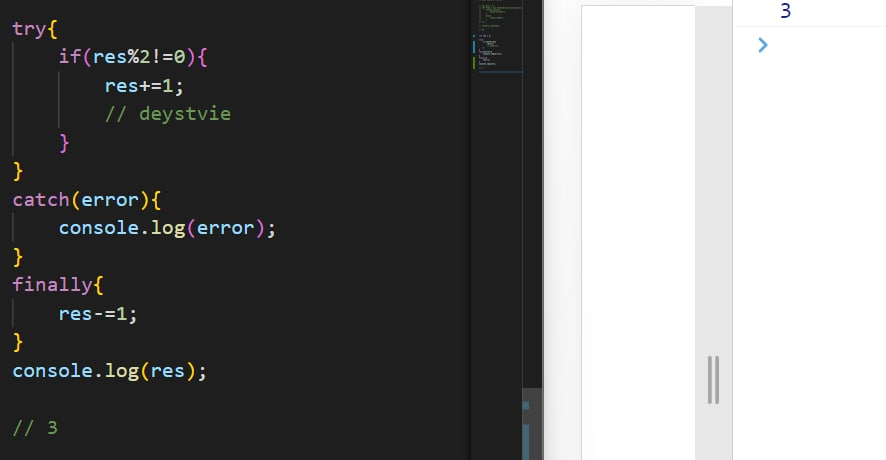